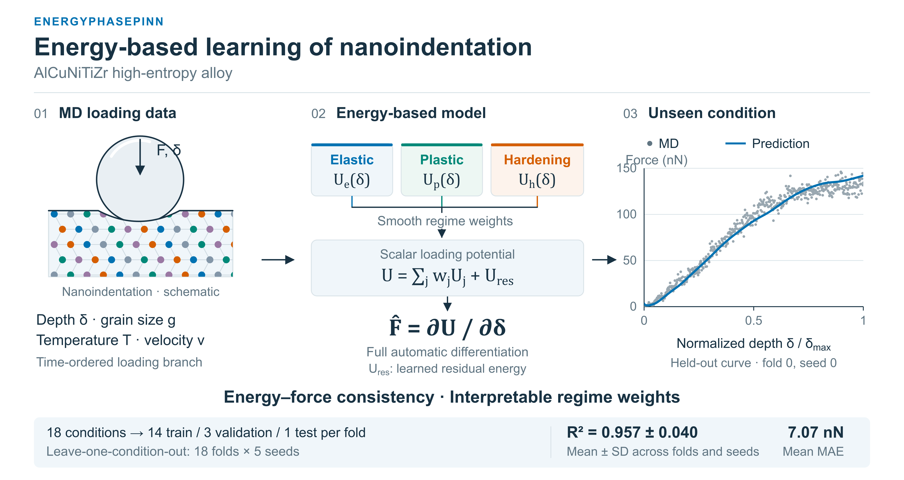
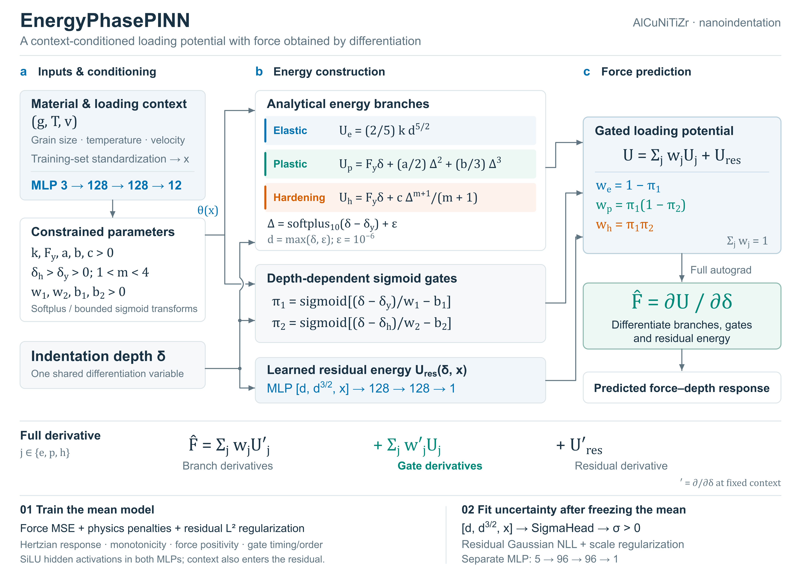

# EnergyPhasePINN

A physics-informed neural network for nanoindentation force-depth prediction (AlCuNiTiZr
high-entropy alloy) that predicts force as the derivative of a single, learned, gated
free-energy potential, rather than as a direct network output. This repository contains
the model, training/evaluation code, and reproducible comparison against its direct-force
ablation (**PhasePINN**) and a Gaussian Process Regression baseline (**GPR**).

**Headline result:** EnergyPhasePINN and PhasePINN are statistically indistinguishable in
raw accuracy (R² = 0.957 ± 0.040 vs. 0.963 ± 0.029, paired t-test p = 0.09), but
EnergyPhasePINN provides physical interpretability that PhasePINN's direct-force branches
do not. Both PINNs are substantially more reliable than GPR at the extremes of the tested
design, where GPR's per-condition R² collapses to as low as -0.002 while both PINNs stay
above 0.94 everywhere. See [Results](#results) below.



*(a) the problem and the loading-branch fix (R² 0.686→0.957); (b) which model to trust at
the design extremes -- GPR's per-fold R² collapses to −0.002 at the two highest velocities
tested while both PINNs stay above 0.94 everywhere; (c) the gap diagnosed rather than
asserted -- 74% of the PINN-vs-GPR R² gap traces to those same two extreme folds (11% of
the design), and the EnergyPhasePINN-vs-PhasePINN accuracy "edge" is not statistically
significant (p=0.09) -- its real contribution is interpretability and a measured
5-19% gate-derivative force contribution. Every number is computed directly from
`results/runs_all.csv` (1248 runs) -- nothing here is illustrative. Figure source:
[`figures/graphical_abstract.pdf`](figures/graphical_abstract.pdf) (vector, embedded fonts);
architecture diagram below is [`figures/architecture.pdf`](figures/architecture.pdf).

## Contents

```
src/
  models.py         EnergyPhasePINN, PhasePINN, SigmaHead (PyTorch)
  data.py           loading-branch extraction, leave-one-condition-out (LOCO) folds
  train.py          training loop, regression + calibration metrics
  gpr_baseline.py    GPR baseline under the identical protocol
  pub_style.py       journal-quality matplotlib style (used by make_figures.py)
data/
  Indent_AlCuNiTiZr.csv   simulation data (9,966 rows, 18 conditions)
run_experiments.py   resumable experiment grid (writes results/runs.jsonl)
make_figures.py      regenerates every figure/table in this README from runs.jsonl
generate_figure_data.py  per-point raw arrays needed by make_figures.py's Fig. 1 / Fig. 6
notebooks/
  Comparison.ipynb    the analysis in this README, as an executable notebook
results/              JSON-lines of every run + aggregated CSV/JSON summaries
figures/              publication-quality figures (PDF, vector; PNG, 600 dpi, for inline
                      display). Fig1-9 are the reviewer-response figures (Table-linked);
                      graphical_abstract.pdf / architecture.pdf are the two figures above.
  make_diagrams.py    exports architecture.svg / graphical_abstract.svg to PDF+PNG via
                      Inkscape (source SVGs are generated, not committed -- see below)
  build_architecture.py, build_graphical_abstract.py
                      regenerate the two SVGs from scratch (from results/runs_all.csv,
                      results/figure_data/*.npz); rebuilding overwrites manual SVG edits
  FIGURE_NOTES.md      captions, provenance, and full editing/export instructions
```

Only the PDF and PNG are committed for `graphical_abstract` and `architecture` (not the
intermediate SVG) so the repository ships one unambiguous vector master per figure; the
SVG is a build artifact of `build_architecture.py` / `build_graphical_abstract.py`,
regenerable with Inkscape installed (see `figures/FIGURE_NOTES.md`).

## The model



*Every energy branch and gate is a function of the same leaf tensor `delta`, so the
automatic-differentiation force F = dU/d&#948; (orange) is the exact derivative of the total
blend -- including the `d&#960;/d&#948;` gate-derivative terms, not just the weighted branch
forces (see `EnergyPhasePINN.force_decomposition` in `src/models.py`, and Table 6 /
`results/gate_decomposition.json` for how large that gate-derivative contribution is in
practice).*

### EnergyPhasePINN

Given depth $\delta$ and context $(g, T, v)$ = (grain size, temperature, velocity), a small
network maps context to physically-bounded parameters (stiffness $k$, yield depth
$\delta_y$, hardening onset $\delta_h$, hardening exponent $m$, ...), which define three
regime energies:

- **Elastic:** $U_e = \tfrac{2}{5} k\,\delta^{5/2}$ (Hertzian contact)
- **Plastic:** $U_p = F_y\delta + \tfrac12 a\Delta^2 + \tfrac13 b\Delta^3$, where
  $\Delta = \mathrm{softplus}(\delta-\delta_y)$
- **Hardening:** $U_h = F_y\delta + \tfrac{c}{m+1}\Delta^{m+1}$

and two smooth sigmoid gates $\pi_1(\delta), \pi_2(\delta)$ blend them:

$$U(\delta; g,T,v) = (1-\pi_1)\,U_e + \pi_1(1-\pi_2)\,U_p + \pi_1\pi_2\,U_h + U_\text{res}$$

The predicted force is obtained by **automatic differentiation of the total energy**,
$F = dU/d\delta$, so it necessarily includes the gate-derivative terms
($d\pi_1/d\delta$, $d\pi_2/d\delta$) as well as the weighted branch forces — force can
never be inconsistent with the model's own claimed energy landscape. See `models.py`,
`EnergyPhasePINN.force_decomposition`, for the exact split between the two.

### PhasePINN (ablation)

The same three-regime gating structure and network architecture, but force is predicted
**directly** by each branch (no shared energy potential, no automatic-differentiation
step). PhasePINN isolates the effect of the energy-based formulation itself: any
difference between EnergyPhasePINN and PhasePINN is attributable to deriving force from
energy rather than to the gating idea in general.

### GPR baseline

`gpr_baseline.py` trains a `GaussianProcessRegressor` (constant × RBF + white-noise
kernel) on the same depth-power features and context, matching the 3,000-point training
budget used for GPR in the associated manuscript.

## Reproducibility

```bash
python -m venv .venv && source .venv/bin/activate   # or your preferred env manager
pip install -r requirements.txt

# full grid: ~1000 runs, several hours on a single GPU (RTX 4070 used here)
python run_experiments.py

# or a fast smoke test (1 seed, 3 folds, a few minutes):
python run_experiments.py --quick

# regenerate every figure and table in this README from results/runs.jsonl:
python make_figures.py
```

`run_experiments.py` is resumable: each run is keyed by
`{experiment}|{model}|{protocol}|{fold}|{seed}` and appended to `results/runs.jsonl`;
re-running the script skips keys already present, so an interrupted grid can be restarted
without repeating finished work. Every run is seeded
(`torch.manual_seed`, `np.random.seed`, `random_state=seed` on GPR), so results are exactly
reproducible given the same code, package versions, and `data/Indent_AlCuNiTiZr.csv`
(SHA-256 in `results/data_sha256.txt`). Package/CUDA versions used to produce the numbers
below are recorded in `results/environment.json`.

`notebooks/Comparison.ipynb` reproduces every figure and table below, executed end-to-end.

### Evaluation protocol

**Leave-one-condition-out (LOCO):** the dataset covers 18 distinct (grain size,
temperature, velocity) combinations, arranged as a one-factor-at-a-time star around a
central condition. Each of the 18 conditions is held out in turn as an entirely unseen
extrapolation target; the model trains on the other 17 (with 3 further conditions held
aside as a group-disjoint validation set for early stopping, so the test condition is
never used for model selection). This is deliberately **not** a random point-wise split:
a naive 80/20 split over pooled points lets points from the same indentation curve appear
in both train and test, which measures interpolation, not the extrapolation to a new
material/loading condition that the model is meant for. See `data.py::loco_folds`.

**Loading-branch extraction:** only the loading portion of each force-depth curve is used
for training. `data.py::keep_loading` extracts it using the *original row order*, which we
verified is the simulation's time sequence (depth increases monotonically to a single apex
then decreases, for all 18 conditions) — not by sorting on depth, which can interleave
loading and unloading points that happen to share a depth value.

## Results

All numbers: mean ± SD across folds × seeds, from `results/runs.jsonl`
(regenerate with `python run_experiments.py`).

### Full-budget LOCO comparison

| Model | R² | MAE (nN) | RMSE (nN) | n runs |
|---|---|---|---|---|
| EnergyPhasePINN | 0.957 ± 0.040 | 7.07 | 9.05 | 90 (18 folds × 5 seeds) |
| PhasePINN | 0.963 ± 0.029 | 6.58 | 8.47 | 90 |
| GPR (3,000 pts) | 0.834 ± 0.296 | 11.91 | 14.58 | 54 (18 folds × 3 seeds) |

### Is EnergyPhasePINN vs. PhasePINN significant? No.

Paired t-test on per-fold mean R² (18 folds): **p = 0.090**; EnergyPhasePINN has the
higher R² in only 6/18 folds. We do not claim EnergyPhasePINN is more accurate than
PhasePINN — its contribution is interpretability and guaranteed force-energy consistency
(see [The model](#the-model)), not raw predictive accuracy.

### Are the PINNs significantly better than GPR? Marginally, and for a specific reason.

| Comparison | paired t | p | wins |
|---|---|---|---|
| EnergyPhasePINN vs. GPR | 1.86 | 0.081 | 9/18 |
| PhasePINN vs. GPR | 2.00 | 0.062 | 12/18 |

GPR is competitive with both PINNs on 16/18 held-out conditions (R² > 0.9), but fails
**catastrophically** on the two most extreme conditions in the design — the highest two
indentation velocities tested (v = 40, 50 nm/s) — where its R² falls to 0.23 and -0.002.
Both PINNs remain accurate at every single held-out condition, including those two
(R² > 0.94 throughout). Because the failure is concentrated in a couple of folds rather
than spread evenly, the *paired* significance test is only marginal (p ≈ 0.06-0.08), but
the *mean* error gap is large and driven entirely by this reliability difference: MAE is
6.4-7.1 nN for the PINNs vs. 11.9 nN for GPR. We read this as the expected failure mode of
a stationary-kernel (RBF) regressor extrapolating past the edge of its training support,
versus the physics-structured PINNs, which extrapolate through their closed-form
contact-mechanics terms rather than through local similarity to training points. See
`figures/Fig9_per_fold_reliability.png` and `results/gpr_significance.json`.

### Other checks

- **Data leakage:** the same EnergyPhasePINN reaches R² = 0.984 ± 0.0005 under a pooled
  random 80/20 split vs. R² = 0.957 ± 0.040 under honest LOCO — quantifying how much a
  point-wise split overstates performance on this kind of grouped data
  (`figures/Fig3_leakage_effect.png`).
- **Loading-branch extraction:** the depth-sorted (rather than time-ordered) extraction
  used in an earlier version of this work retains unloading points that share a depth with
  loading points, dropping LOCO R² from 0.957 to 0.686
  (`figures/Fig1_loading_branch_correction.png`).
- **Gate-derivative force contribution:** the $d\pi/d\delta$ terms contribute 5-19% of the
  total predicted force, concentrated in the phase-transition regions
  (`figures/Fig6_gate_derivative_decomposition.png`,
  `results/gate_decomposition.json`).
- **Uncertainty calibration:** a heteroscedastic $\sigma$-head gives PICP@1$\sigma$ = 68.5%
  (target ~68%) and PICP@2$\sigma$ = 85.8% (target ~95%, i.e. the tails are somewhat too
  light) (`figures/Fig7_calibration.png`).

## Citation

If you use this code, please cite the associated manuscript (citation to be added on
publication).

## License

MIT — see `LICENSE`. The dataset (`data/Indent_AlCuNiTiZr.csv`) is simulation output
released alongside this code; please cite the manuscript if you reuse it.
